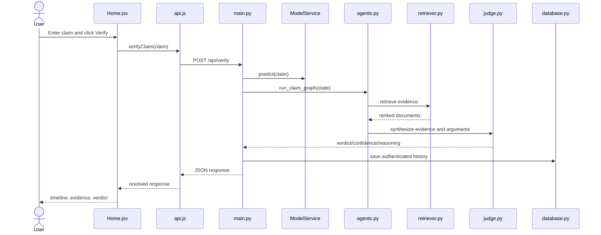
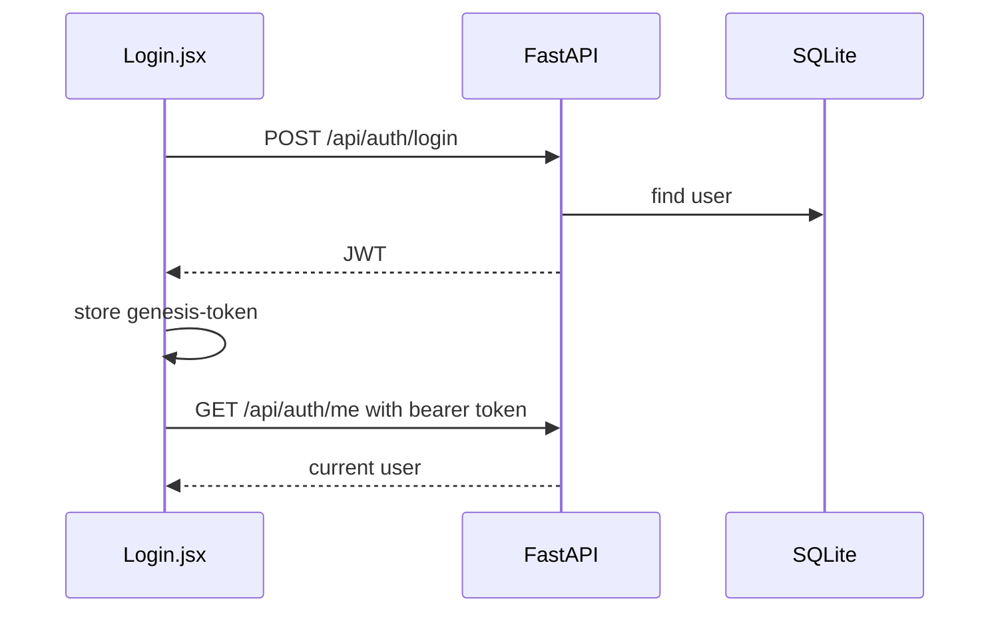
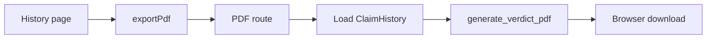

# Code Flow

## Verification sequence

```mermaid
sequenceDiagram
  actor User
  participant React as Home.jsx
  participant Axios as api.js
  participant FastAPI as main.py
  participant ML as ModelService
  participant Graph as agents.py
  participant Search as retriever.py
  participant Judge as judge.py
  participant DB as database.py
  User->>React: Enter claim and click Verify
  React->>Axios: verifyClaim(claim)
  Axios->>FastAPI: POST /api/verify
  FastAPI->>ML: predict(claim)
  FastAPI->>Graph: run_claim_graph(state)
  Graph->>Search: retrieve evidence
  Search-->>Graph: ranked documents
  Graph->>Judge: synthesize evidence and arguments
  Judge-->>FastAPI: verdict/confidence/reasoning
  FastAPI->>DB: save authenticated history
  FastAPI-->>Axios: JSON response
  Axios-->>React: resolved response
  React-->>User: timeline, evidence, verdict
```

## Authentication sequence

```mermaid
sequenceDiagram
  participant UI as Login.jsx
  participant API as FastAPI
  participant DB as SQLite
  UI->>API: POST /api/auth/login
  API->>DB: find user
  API-->>UI: JWT
  UI->>UI: store genesis-token
  UI->>API: GET /api/auth/me with bearer token
  API-->>UI: current user
```

## PDF flow

```mermaid
flowchart LR
  History[History page] --> Client[exportPdf]
  Client --> API[PDF route]
  API --> DB[Load ClaimHistory]
  DB --> ReportLab[generate_verdict_pdf]
  ReportLab --> Download[Browser download]
```
